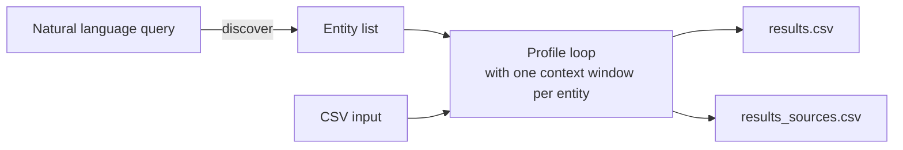

# Varys

A market intelligence tool for the health IT ecosystem with four capabilities:

- **Vendor discovery** — Build a competitor list from natural language. "Find AI scribe competitors to Nuance" → curated company list → CSV ready for profiling.
- **Vendor profiling** — Profile health IT companies for competitive analysis. Who are they, what do they sell, who have they sold to, how are they funded, and what is their regulatory status?
- **Health system discovery** — Discover hospitals and health systems by US state from the public CMS dataset. No input list needed — a free, open-source alternative to [Definitive Healthcare](https://www.definitivehc.com/).
- **Health system profiling** — Profile hospitals and health systems for BD prospecting. EHR vendor, bed count, CMS star rating, payer mix, CIO name, and more.

<div align="center">

</div>

<br/>

Two ways to use this tool:

**One at a time (interactive)** — Load a skill file into any AI assistant (Claude, ChatGPT, Gemini, etc.) and research entities conversationally. Ask follow-up questions, refine results, and build a competitor list interactively before exporting.

**Batch (CLI)** — Run `varys.py` to process a CSV list end-to-end. Outputs clean values and source-cited results at any scale.

## Useful for

BD teams, competitive intelligence analysts, and market researchers in health IT who need structured, source-cited data without a Definitive Healthcare subscription.

## Quickstart

### Interactive (AI assistant)

Load a skill file from the `skills/` folder into your AI assistant of choice. Then either ask:

```
Find me AI scribe competitors to Nuance
```

The assistant will propose a list and let you refine it ("remove Nuance itself", "add Suki", "only keep Series B+") before exporting to CSV.

Or use a slash command:

```
/profile-health-it-vendor Abridge
```

### Batch (CLI)

```bash
# Install dependencies
pip install -r requirements.txt

# Set your API key
export ANTHROPIC_API_KEY=sk-ant-...

# --- Vendors ---
# Discover competitors via natural language (prompts for query)
python varys.py discover vendor --output discovered_vendors.csv
# Profile vendors from a list
python varys.py profile vendor --input discovered_vendors.csv --output results.csv
# Or do both in one shot
python varys.py pipeline vendor --output results.csv

# --- Health systems ---
# Discover all hospitals in California from CMS public data
python varys.py discover health-system --state CA --output ca_hospitals.csv
# Profile health systems from a list
python varys.py profile health-system --input ca_hospitals.csv --output ca_results.csv
# Or do both in one shot
python varys.py pipeline health-system --state CA --output ca_results.csv
```

## Architecture



## Output

Every run writes two CSVs:

| File | Contents | Use case |
|---|---|---|
| `results.csv` | Clean values only | Downstream consumption, import, sharing |
| `results_sources.csv` | Values + source URLs + confidence levels | QA, verification, auditing |

### Vendor skill fields

`results_sources.csv` adds `_source` and `_confidence` for every field.

| Field | Values |
|---|---|
| `product_category` | AI Scribe / EHR / RCM / Care Management / CDT / Patient Engagement / Clinical Decision Support / Interoperability / Other |
| `primary_customer` | Provider / Payer / Employer / DTC |
| `business_model` | SaaS / Per-Seat / PMPM / Implementation Fee / Usage-Based / Other |
| `fda_status` | Not Required / Cleared / Breakthrough Device / PMA / Pending / Unknown |
| `funding_stage` | Seed / Series A / Series B / Series C / Series D+ / Public / Profitable / Unknown |
| `clinical_evidence` | true / false |

**Free-text fields:** `entity_name`, `ehr_integrations`, `notable_health_system_customers`, `total_funding`, `key_investors`, `num_employees`, `headquarters`, `founded_year`

### Health system skill fields

`results_sources.csv` adds `_source` and `_confidence` for every field.

| Field | Values |
|---|---|
| `ownership_type` | Non-profit / For-profit / Academic / Government / Unknown |
| `ehr_vendor` | Epic / Oracle Health / Meditech / Allscripts / athenahealth / Other / Unknown |
| `cms_star_rating` | 1 / 2 / 3 / 4 / 5 / null |
| `teaching_hospital` | true / false |
| `vbc_participation` | true / false |
| `innovation_program` | true / false |
| `geographic_region` | Northeast / Southeast / Midwest / Southwest / West |

**Free-text fields:** `entity_name`, `health_system`, `bed_count`, `payer_mix`, `annual_revenue`, `recent_tech_announcements`, `cio_name`

## CLI subcommands

```
varys.py discover vendor       # prompts for query → writes entity CSV
varys.py discover health-system --state CA   # CMS data → writes entity CSV
varys.py profile vendor --input vendors.csv
varys.py profile health-system --input hospitals.csv
varys.py pipeline vendor       # discover + profile in one shot (interactive query)
varys.py pipeline health-system --state CA   # discover + profile in one shot
```

**`discover` flags:**

| Flag | Default | Description |
|---|---|---|
| `--state` | _(required for health-system)_ | Two-letter state code (e.g. `CA`, `NY`). |
| `--output` | _(varies)_ | `vendor-results.csv` or `<STATE>-health-systems.csv` |
| `--model` | `claude-sonnet-4-6` | Anthropic model (vendor only). Override via `ANTHROPIC_MODEL`. |

**`profile` and `pipeline` flags:**

| Flag | Default | Description |
|---|---|---|
| `--input` | _(required for profile)_ | Input CSV with `entity_name` column. |
| `--output` | see below | Output CSV. A `_sources.csv` is auto-written alongside it. |
| `--batch` | false | Hybrid batch + agentic mode. See [Batch vs agentic mode](#batch-vs-agentic-mode). |
| `--concurrency` | `1` | Parallel API calls. Default is 1 (sequential). Increase based on your Anthropic rate limit tier — see [Concurrency and rate limits](#concurrency-and-rate-limits). |
| `--model` | `claude-sonnet-4-6` | Anthropic model. Override via `ANTHROPIC_MODEL`. |
| `--yes` | false | Skip the cost confirmation prompt. |

Default `--output` filenames: `varys-vendor-research-results.csv`, `varys-health-system-research-results.csv`, `vendor-pipeline-results.csv`, `<state>-pipeline-results.csv`.

## Requirements

- `ANTHROPIC_API_KEY` — set in environment before running
- `anthropic>=0.84.0`
- `pyyaml>=6.0`

## Batch vs agentic mode

Anthropic's [Messages Batches API](https://docs.anthropic.com/en/docs/build-with-claude/message-batches) offers a 50% discount off regular API pricing by processing requests asynchronously. `--batch` uses this to keep costs low without sacrificing quality — it starts with a cost-efficient single-shot pass, then automatically runs the full agentic loop only on entities where the batch returned weak or missing fields. This is the tradeoff: lower cost at the expense of a longer total turnaround.

| | `--batch` (hybrid) | Default (agentic) |
|---|---|---|
| **How it works** | Single-shot with adaptive thinking (50% discount), then agentic follow-up on weak fields only | Full multi-round agentic loop from the start |
| **Well-known companies** | Excellent — high confidence, minimal follow-up needed | Excellent |
| **Obscure/early-stage companies** | Good — adaptive thinking helps, agentic follow-up catches gaps | Best — multi-round web research from the start |
| **Cost** | ~$0.02/company in tests | ~$0.20/company |
| **Turnaround** | ~1 hour for 10 companies (async, Anthropic-side queue) | ~2–3 min per entity sequentially |
| **Rate limit pressure** | None during batch phase; agentic follow-up is subject to your TPM limit | Subject to your TPM limit throughout |

**Rule of thumb:** use `--batch` when you want to optimize for cost over latency, or your list is mostly well-known companies. Use agentic when you need results immediately or your list is mostly obscure/early-stage companies.

The CLI always shows a cost estimate and requires confirmation before any API call. Use `--yes` to skip this in CI or scripted workflows.

> Cost estimates based on claude-sonnet-4-6 (March 2026). Model pricing changes — always check [anthropic.com/pricing](https://anthropic.com/pricing) before large runs.

## Concurrency and rate limits

The default `--concurrency 1` runs entities sequentially. Agentic calls with web search accumulate large contexts — a single round can send 10,000–20,000 input tokens. Running multiple entities in parallel multiplies this and can trigger 429 rate limit errors.

Adjust based on your Anthropic usage tier:

| Rate limit | Recommended `--concurrency` |
|---|---|
| 30,000 input tokens/min | 1 (default) — even sequential can occasionally hit limits on heavy searches |
| 100,000 input tokens/min | 3–5 |
| 200,000+ input tokens/min | 5–10 |

Rate limit errors are retried automatically with exponential backoff (60s, then 120s), so a run will always complete — it just takes longer at lower tiers.

**`--batch` is unaffected by this limit** — batch requests are processed asynchronously on Anthropic's side and have a separate rate limit bucket.

## Further reading

For design decisions — why Python over an LLM orchestrator, how context isolation works, source priority per field, and how to tune research depth — see [Architecture & Design Decisions](docs/design.md).

If you use OpenAI or Gemini instead of Anthropic, see [Using with other AI assistants](docs/other-assistants.md) to adapt `varys.py` to another provider.

This project was built while working through DeepLearning.AI's course, [Agent Skills with Anthropic](https://www.deeplearning.ai/short-courses/agent-skills-with-anthropic/).