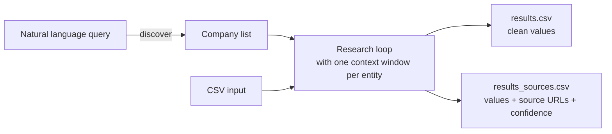

# healthtech-intel

A market intelligence tool for the health IT ecosystem with three capabilities:

- **Vendor discovery** — Build a competitor list from natural language. "Find AI scribe competitors to Nuance" → curated company list → CSV ready for research.
- **Vendor research** — Profile health IT companies for competitive analysis. Who are they, what do they sell, who have they sold to, how are they funded, and what is their regulatory status?
- **Health system research** — Profile hospitals and health systems for BD prospecting. Built-in discovery by US state — no input list needed. A free, open-source alternative to [Definitive Healthcare](https://www.definitivehc.com/), powered by the public CMS API.

Two ways to use this tool:

**One at a time (interactive)** — Load a skill file into any AI assistant (Claude, ChatGPT, Gemini, etc.) and research entities conversationally. Ask follow-up questions, refine results, and build a competitor list interactively before exporting.

**Batch (CLI)** — Run `healthtech-intel.py` to process a CSV list end-to-end. Outputs clean values and source-cited results at any scale.

## Useful for

BD teams, competitive intelligence analysts, and market researchers in health IT who need structured, source-cited data without a Definitive Healthcare subscription.

## Quickstart

### Interactive (AI assistant)

Load a skill file from the `skills/` folder into your AI assistant of choice. Then either ask:

```
Find me AI scribe competitors to Nuance
```

The assistant will propose a list and let you refine it ("remove Nuance itself", "add Suki", "only keep Series B+") before exporting to CSV.

Or use a slash command:

```
/profile-health-it-vendor Abridge
```

### Batch (CLI)

```bash
# Install dependencies
pip install -r requirements.txt

# Set your API key
export ANTHROPIC_API_KEY=sk-ant-...

# Discover competitors via natural language (prompts for query), then profile them
python healthtech-intel.py discover vendor --output discovered_vendors.csv
python healthtech-intel.py research vendor --input discovered_vendors.csv --output results.csv

# Or do both in one shot with the pipeline command
python healthtech-intel.py pipeline vendor --output results.csv

# Profile vendors from a known list
python healthtech-intel.py research vendor --input sample_vendors.csv --output results.csv

# Profile health systems from a list
python healthtech-intel.py research health-system --input sample_health_systems.csv --output results.csv

# Discover all hospitals in California from CMS public data, then profile them
python healthtech-intel.py discover health-system --state CA --output ca_hospitals.csv
python healthtech-intel.py research health-system --input ca_hospitals.csv --output ca_results.csv

# Or do both in one shot with the pipeline command
python healthtech-intel.py pipeline health-system --state CA --output ca_results.csv
```

## Architecture



## Output

Every run writes two CSVs:

| File | Contents | Use case |
|---|---|---|
| `results.csv` | Clean values only | Downstream consumption, import, sharing |
| `results_sources.csv` | Values + source URLs + confidence levels | QA, verification, auditing |

### Vendor skill fields

`results_sources.csv` adds `_source` and `_confidence` for every field.

| Field | Values |
|---|---|
| `product_category` | AI Scribe / EHR / RCM / Care Management / CDT / Patient Engagement / Clinical Decision Support / Interoperability / Other |
| `primary_customer` | Provider / Payer / Employer / DTC |
| `business_model` | SaaS / Per-Seat / PMPM / Implementation Fee / Usage-Based / Other |
| `fda_status` | Not Required / Cleared / Breakthrough Device / PMA / Pending / Unknown |
| `funding_stage` | Seed / Series A / Series B / Series C / Series D+ / Public / Profitable / Unknown |
| `clinical_evidence` | true / false |

**Free-text fields:** `entity_name`, `ehr_integrations`, `notable_health_system_customers`, `total_funding`, `key_investors`, `num_employees`, `headquarters`, `founded_year`

### Health system skill fields

`results_sources.csv` adds `_source` and `_confidence` for every field.

| Field | Values |
|---|---|
| `ownership_type` | Non-profit / For-profit / Academic / Government / Unknown |
| `ehr_vendor` | Epic / Oracle Health / Meditech / Allscripts / athenahealth / Other / Unknown |
| `cms_star_rating` | 1 / 2 / 3 / 4 / 5 / null |
| `teaching_hospital` | true / false |
| `vbc_participation` | true / false |
| `innovation_program` | true / false |
| `geographic_region` | Northeast / Southeast / Midwest / Southwest / West |

**Free-text fields:** `entity_name`, `health_system`, `bed_count`, `payer_mix`, `annual_revenue`, `recent_tech_announcements`, `cio_name`

## CLI subcommands

```
healthtech-intel.py discover vendor       # prompts for query → writes entity CSV
healthtech-intel.py discover health-system --state CA   # CMS data → writes entity CSV
healthtech-intel.py research vendor --input vendors.csv
healthtech-intel.py research health-system --input hospitals.csv
healthtech-intel.py pipeline vendor       # discover + research in one shot (interactive query)
healthtech-intel.py pipeline health-system --state CA   # discover + research in one shot
```

**`discover` flags:**

| Flag | Subcommand | Default | Description |
|---|---|---|---|
| `--state` | `health-system` | _(required)_ | Two-letter state code (e.g. `CA`, `NY`). |
| `--output` | both | see below | Output CSV. Default: `vendor-results.csv` or `<state>-health-systems.csv`. |
| `--model` | `vendor` | `claude-sonnet-4-6` | Anthropic model. Override via `ANTHROPIC_MODEL` env var. |

**`research` and `pipeline` flags:**

| Flag | Default | Description |
|---|---|---|
| `--input` | _(required for research)_ | Input CSV with `entity_name` column. |
| `--output` | see below | Clean output CSV. A `_sources.csv` is auto-written alongside it. |
| `--batch` | false | Use Messages Batches API (~50% cost discount, async). |
| `--concurrency` | `5` | Number of parallel API calls. Recommended range: 5–10. |
| `--model` | `claude-sonnet-4-6` | Anthropic model. Override via `ANTHROPIC_MODEL` env var. |
| `--yes` | false | Skip the cost confirmation prompt. |

Default output filenames: `healthtech-intel-vendor-research-results.csv`, `healthtech-intel-health-system-research-results.csv`, `vendor-pipeline-results.csv`, `<state>-pipeline-results.csv`.

## Requirements

- `ANTHROPIC_API_KEY` — set in environment before running
- `anthropic>=0.40.0`
- `pyyaml>=6.0`

## Cost

The CLI shows an estimate and requires confirmation before any API call.

**Real-world cost: ~$0.50 per company** (your mileage will vary by entity size and obscurity).

| Companies | Estimated total |
|---|---|
| 1 | ~$0.15 – $0.50 |
| 10 | ~$1.50 – $5.00 |
| 100 | ~$15 – $50 |

**`--batch` uses the [Messages Batches API](https://docs.anthropic.com/en/docs/build-with-claude/message-batches) for a ~50% cost discount.** Results are processed asynchronously — the CLI polls until complete, which can take minutes to hours depending on queue depth. Use it for large lists where cost matters more than turnaround time.

```bash
python healthtech-intel.py research vendor --input vendors.csv --output results.csv --batch
```

> Prices above are estimates only. Model pricing changes frequently. Always check [anthropic.com/pricing](https://anthropic.com/pricing) before large runs.

Use `--yes` to skip the confirmation prompt in CI or scripted workflows.

## Further reading

For design decisions — why Python over an LLM orchestrator, how context isolation works, source priority per field, and how to tune research depth — see [Architecture & Design Decisions](docs/design.md).

If you use OpenAI or Gemini instead of Anthropic, see [Using with other AI assistants](docs/other-assistants.md) to adapt `healthtech-intel.py` to another provider.

This project was built while working through DeepLearning.AI's course, [Agent Skills with Anthropic](https://www.deeplearning.ai/short-courses/agent-skills-with-anthropic/).