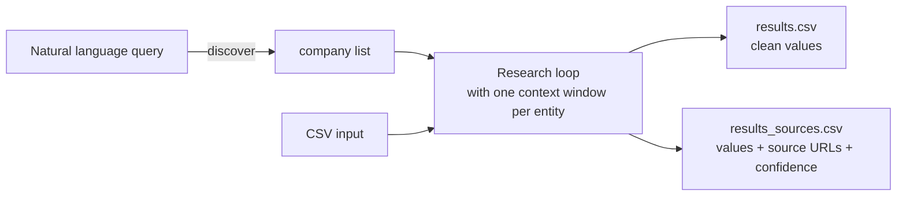

# healthtech-intel

A market intelligence tool for the health IT ecosystem with three skills:

- **Vendor discovery** — Build a competitor list from natural language. "Find AI scribe competitors to Nuance" → curated company list → CSV ready for research.
- **Vendor research** — Profile health IT companies for competitive analysis. Who are they, what do they sell, who have they sold to, how are they funded, and what is their regulatory status?
- **Health system research** — Profile hospitals and health systems for BD prospecting. Built-in discovery by US state — no input list needed. A free, open-source alternative to [Definitive Healthcare](https://www.definitivehc.com/), powered by the public CMS API.

---

## Architecture



Three ways to use this tool:

| Interface | Use case |
|---|---|
| **Coding assistant discovery agent** | Build a competitor list from natural language, iteratively |
| **Coding assistant research skill** | Profile a single company or health system, interactively |
| **CLI batch runner** (`research.py`) | CSV → CSV at any scale |

The same skill files (`.claude/skills/`) drive both the coding assistant and CLI. A single edit to a skill propagates to both.

---

## Useful for

BD teams, competitive intelligence analysts, and market researchers in health IT who need structured, source-cited data without a Definitive Healthcare subscription.

---

## Quickstart

```bash
# Install dependencies
pip install -r requirements.txt

# Set your API key
export ANTHROPIC_API_KEY=sk-ant-...

# Discover competitors via natural language, then profile them
python research.py --skill researching-health-it-vendor \
  --discover-query "AI scribe competitors to Nuance" \
  --output results.csv

# Profile vendors from a known list
python research.py --skill researching-health-it-vendor --input sample_vendors.csv --output results.csv

# Profile health systems from a list
python research.py --skill researching-health-system --input sample_health_systems.csv --output results.csv

# Discover all hospitals in California from CMS public data, then profile them
python research.py --skill researching-health-system --discover --state CA --output ca_results.csv
```

### Use your coding assistant (conversational)

Open this project in your coding assistant and use the discovery agent to build a list interactively:

```
Find me AI scribe competitors to Nuance
```

The agent will propose a list, let you refine it ("remove Nuance itself", "add Suki", "only keep Series B+"), then save `discovered_competitors.csv`. Follow up with:

```bash
python research.py --skill researching-health-it-vendor \
  --input discovered_competitors.csv \
  --output results.csv
```

To profile a single entity interactively:

```
Use the researching-health-it-vendor skill to profile Abridge
```

```
Use the researching-health-system skill to profile Mayo Clinic
```

---

## Output

Every run writes two CSVs:

| File | Contents | Use case |
|---|---|---|
| `results.csv` | Clean values only | Downstream consumption, import, sharing |
| `results_sources.csv` | Values + source URLs + confidence levels | QA, verification, auditing |

### Vendor skill output

**Clean output** (`results.csv`):
```
entity_name, product_category, primary_customer, ehr_integrations,
notable_health_system_customers, business_model, fda_status,
clinical_evidence, funding_stage, total_funding, key_investors,
num_employees, headquarters, founded_year
```

**Sources output** (`results_sources.csv`) — same fields, plus `_source` and `_confidence` for every field.

### Health system skill output

**Clean output** (`results.csv`):
```
entity_name, health_system, bed_count, ownership_type, ehr_vendor,
cms_star_rating, teaching_hospital, vbc_participation, payer_mix,
annual_revenue, innovation_program, recent_tech_announcements,
cio_name, geographic_region
```

**Sources output** (`results_sources.csv`) — same pattern.

### Field vocabulary

**Vendor skill:**

| Field | Allowed values |
|---|---|
| `product_category` | AI Scribe / EHR / RCM / Care Management / CDT / Patient Engagement / Clinical Decision Support / Interoperability / Other |
| `primary_customer` | Provider / Payer / Employer / DTC |
| `business_model` | SaaS / Per-Seat / PMPM / Implementation Fee / Usage-Based / Other |
| `fda_status` | Not Required / Cleared / Breakthrough Device / PMA / Pending / Unknown |
| `funding_stage` | Seed / Series A / Series B / Series C / Series D+ / Public / Profitable / Unknown |
| `clinical_evidence` | true / false |

**Health system skill:**

| Field | Allowed values |
|---|---|
| `ownership_type` | Non-profit / For-profit / Academic / Government / Unknown |
| `ehr_vendor` | Epic / Oracle Health / Meditech / Allscripts / athenahealth / Other / Unknown |
| `cms_star_rating` | 1 / 2 / 3 / 4 / 5 / null |
| `teaching_hospital` | true / false |
| `vbc_participation` | true / false |
| `innovation_program` | true / false |
| `geographic_region` | Northeast / Southeast / Midwest / Southwest / West |

---

## CLI flags

| Flag | Default | Description |
|---|---|---|
| `--skill` | _(required)_ | `researching-health-it-vendor` or `researching-health-system` |
| `--input` | — | Input CSV path. Must have an `entity_name` column. |
| `--output` | _(required)_ | Clean output CSV path. A `_sources.csv` is auto-written alongside it. |
| `--discover-query` | — | Vendor skill only. Natural language query to discover companies, then research them. |
| `--discover` | false | Health-system skill only. Seed entity list from CMS Hospital General Information. |
| `--state` | — | Two-letter state code for `--discover` (e.g. `CA`, `NY`). |
| `--model` | `claude-sonnet-4-6` | Anthropic model name. Override via `ANTHROPIC_MODEL` env var. |
| `--delay` | `1.0` | Seconds between entities in sequential mode (`--concurrency 1`). |
| `--concurrency` | `5` | Number of parallel API calls. Recommended range: 5–10. |
| `--max-entities` | — | Safety cap on entity count. Useful for test runs. |
| `--yes` | false | Skip the cost confirmation prompt. |

---

## Requirements

- `ANTHROPIC_API_KEY` — set in environment before running
- `anthropic>=0.40.0`
- `pyyaml>=6.0`

---

## Cost

The CLI shows an estimate and requires confirmation before any API call.

**Real-world cost: ~$0.50 per company** (your mileage will vary by entity size and obscurity).

| Companies | Estimated total |
|---|---|
| 1 | ~$0.15 – $0.50 |
| 10 | ~$1.50 – $5.00 |
| 100 | ~$15 – $50 |

> Prices above are estimates only. Model pricing changes frequently. Always check [anthropic.com/pricing](https://anthropic.com/pricing) before large runs.

Use `--yes` to skip the confirmation prompt in CI or scripted workflows.

---

## Further reading

For design decisions — why Python over an LLM orchestrator, how context isolation works, source priority per field, and how to tune research depth — see [Architecture & Design Decisions](docs/design.md).

If you use OpenAI or Gemini instead of Anthropic, see [Using with other AI assistants](docs/other-assistants.md) to adapt `research.py` to another provider.
